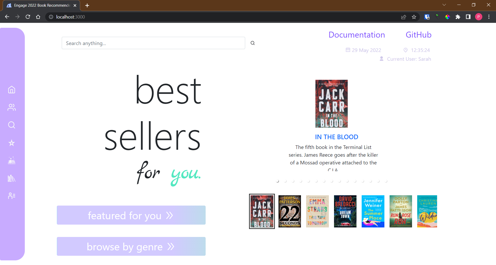
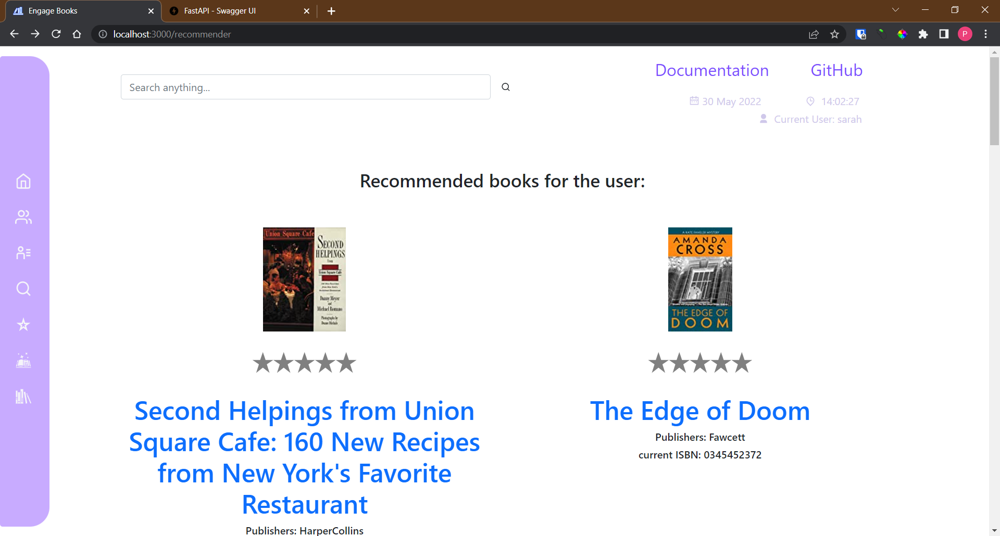
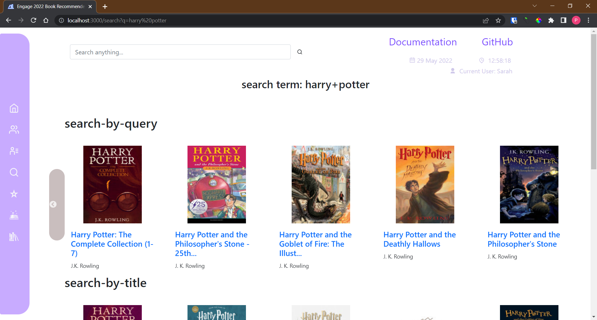
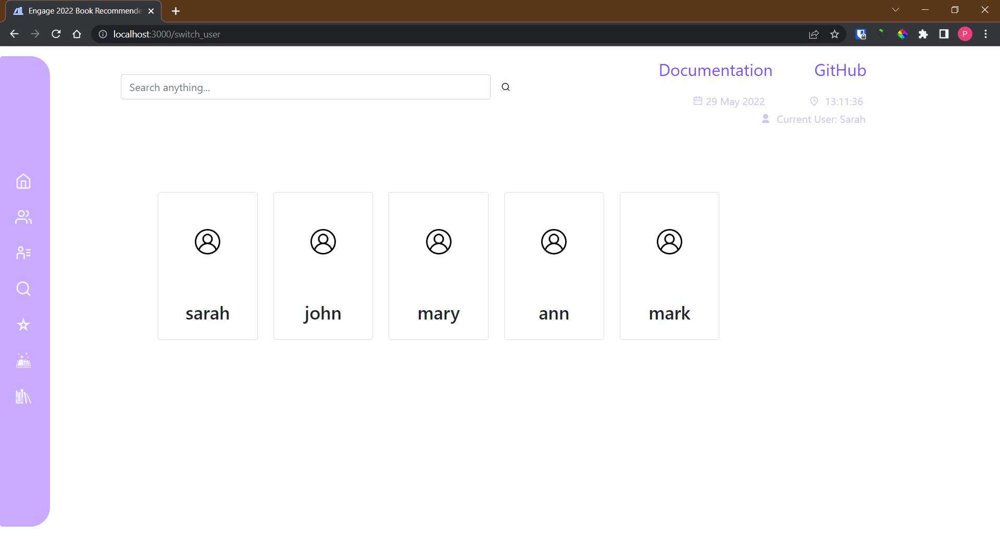

# Book Recommendation Engine

From a database of ratings from users on books, suggest a user a list of books they might like based on the [collaborative filtering](https://developers.google.com/machine-learning/recommendation/collaborative/basics) algorithm. The app is built on ReactJS for fast rendering of UI and FastAPI for fast and efficient server performance. Made for Microsoft Engage 2022 Mentorship program.

# Features

1. An efficient recommendation system making use of collaborative filtering algorithm to suggest the current user 10 books that they might like.
2. Easy switching between FIVE users in the same environment.
3. Simple and quick click on stars rating system.
4. Rating system for every user that influences the recommendations real time!!
5. Fully functioning search feature to search a book with its title, author and even isbn.
6. Retrieve all the books that the current user has rated so far and in app feature to change them.
7. Browse books from New York times best sellers and top rated books in genres, all in app while also having an option to rate them.
8. List the books that are in our huge database.

# Tech Stack used

Frontend - [ReactJS](https://reactjs.org/)
Backend - [FastAPI](https://fastapi.tiangolo.com/), a web framework based on Python to build APIs
Database - [SQLite3](https://docs.python.org/3/library/sqlite3.html), a disk based database packed with Python Standard Library

# External API used

- [Google Books API](https://developers.google.com/books/docs/overview)
- [NY Times API](https://developer.nytimes.com/docs/books-product/1/overview)

# Install dependencies

To install dependencies and required packages, clone the repo. Initialise a terminal in the project folder.

### Frontend

The following dependencies can also be found in [package.json](./client/package.json).

- bootstrap 5.1.3 or above
- react 18.1.0 or above
- react-dom 18.1.0 or above
- react-icons 4.3.1 or above
- react-responsive-carousel 3.2.23 or above
- react-router-dom 6.3.0 or above
- react-script 5.0.1 or above
- react-slick 0.29.0 or above
- slick-carousel 1.8.1 or above
- web-vitals 2.1.4 or above

To install all the packages at once, cd into `./client` and run the command

```
npm install
```

or

```
yarn install
```


### Backend

The following packages are required to run the backend. The list can also be found in [requirements.txt](./server/requirements.txt).
Make sure that Python 3.6 or above is installed before running the following commands.

- `pip install fastapi`
- `pip install pydantic`
- `pip install uvicorn[standard]`
- `pip install pandas`

# Running app

### Database

The database can be created at the instance from the .csv files provided (taken from [Kaggle](https://www.kaggle.com/datasets/saurabhbagchi/books-dataset)) or downloaded. Downloading is suggested.
Changes made while the app is being hosted will be reflected locally in the database as well. 

> Download the database extracted at an instance [here](https://1drv.ms/u/s!AhrbshVITvFzi0vKg037nlLUiVv-?e=5aD9g8) into `./server` directory

or
> Although not suggested due to the amount of resources and time it consumes, to create the initial database, run `./server/makedb.py`

### Backend

To start running the backend on uvicorn server run the following command in `./server` folder.

```
uvicorn main:app --reload
```

 The server by default runs at [http://localhost:8000/](http://localhost:8000/)

### Frontend

To start the frontend, cd into the `./client` folder and run

```
npm start
```

This will start the app, and run it by default on [http://localhost:3000/](http://localhost:3000/)

# Screenshots
### Homepage

### Recommendations page

### Search page

### Users page
